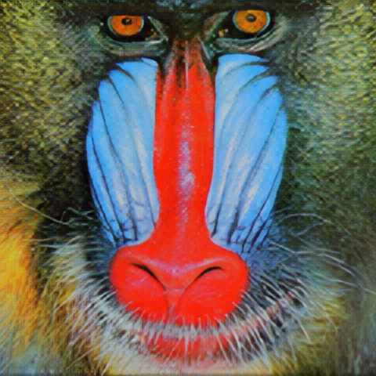

# MTKDSR

## Multi-Teacher Knowledge Distillation for Super Resolution Image Reconstruction 

## Run

```shell

# test
python main.py --Train False --model_name RFDN --checkpoint MTKDSR.pth
# you can set the test datasets in the main.py too.
```


## Citing 

The code is free for academic/research purpose. Please kindly cite our work in your publications if it helps your research.  

```BibTeX
@article{
  title={Multi-Teacher Knowledge Distillation for Super Resolution Image Reconstruction.},
  author={G. Yao, Z. Li, B. Bhanu, Z. Kang, Z. Zhong, Q. Zhang},
  conference={The 26th International Conference on Pattern Recognition (ICPR)},
  year={2022}
  link={DOI:10.1109/ICPR56361.2022.9956250}
}
```


## Example
**Comparison**

<div align=center>
<center class="half">
    </center></div>

<div align=center>
<center class="half">
    </center></div>
    
<div align=center>
<center class="half">
    </center></div>
    
<div align=center>
<center class="half">
    </center></div>
    

[](https://badges.toozhao.com/stats/01F0MPA6GQQXGBJSVKT85C4PKT "Get your own page views count badge on badges.toozhao.com")
